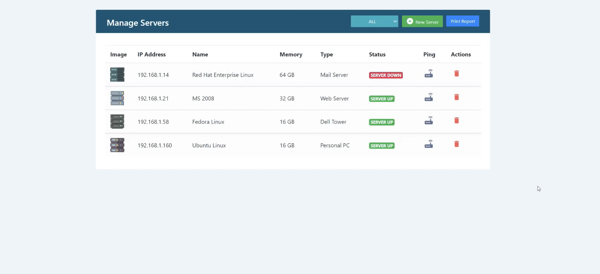
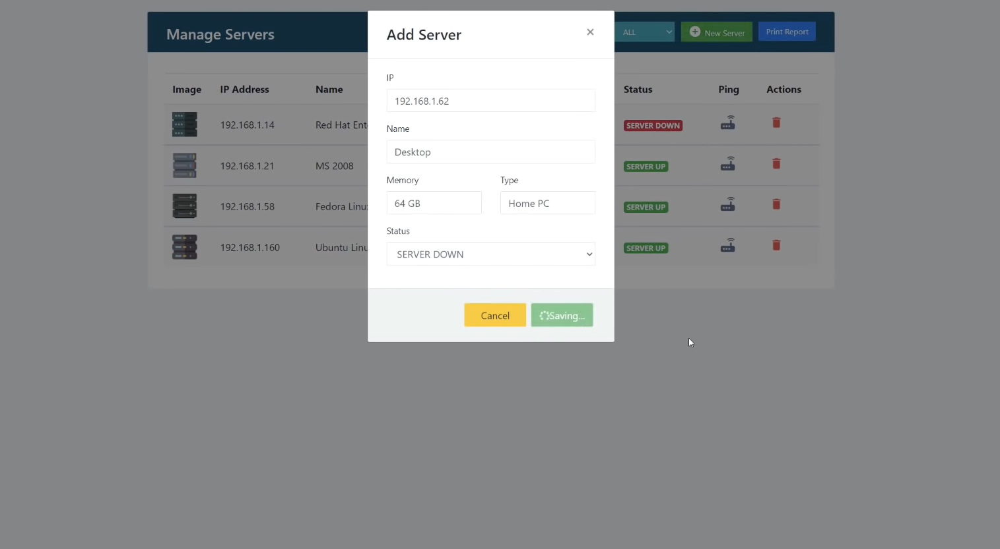

## Server Management Application

The application aims to be a scalable and efficient solution that can manage large-scale server systems effectively. This application uses Spring and Angular frameworks to provide a seamless user experience, incorporating a reactive approach in handling events with RxJS, while Spring Data JPA and MySQL ensure optimal database performance.

The project is built using as inspiration a series of courses from AMIGOSCODE and GETARRAYS, courses from which I have have gained a great deal of technical skills and best practices. The goal was familiarising myself with the Spring and Angualr enviroments, building an end to end fully fledged application. I experimented with projects, libraries and approaches and I got over many challanges along the way.

## Important

The project is devided intro 2 applications that communicate with eachother through REST API's

**BACK-END APPLICATION:** that can be found [HERE](https://github.com/davidandw190/Server-Management-Back-End-SPRING)

**FRONT-END APPLICATION:** that can be found [HERE](https://github.com/davidandw190/Server-Mang-Front-End-ANGULAR-RXJS)

## Preview

## Features

* Server state monitoring
* Sorting servers by: `ALL`, `SERVER UP`, `SERVER DOWN` 
* Simple notification system
* RESTful API communication
* MVC arhitecture principles
* Responsive and user-friendly interface
* Reactive UI design with the help of RxJS

## Technologies Used

### Backend

* Java
* Spring Boot Framework
* Spring Data JPA
* MySQL Database

### Frontend

* Angular Framework
* HTML, CSS, JavaScript
* Bootstrap UI Framework
* RxJS Library

## Installation

To install the application, follow these steps:

1. Clone the BACK-END and FRONT-END repositories:

`git clone https://github.com/davidandw190/Server-Management-Back-End-SPRING.git`
`git clone https://github.com/davidandw190/Server-Mang-Front-End-ANGULAR-RXJS.git`

2. Import the backend and frontend projects into your IDE.

3. Install the dependencies by running the following command in the terminal: `npm install`

4. Configure the application properties file with your MySQL database connection details.
5. Run the backend and frontend servers.

